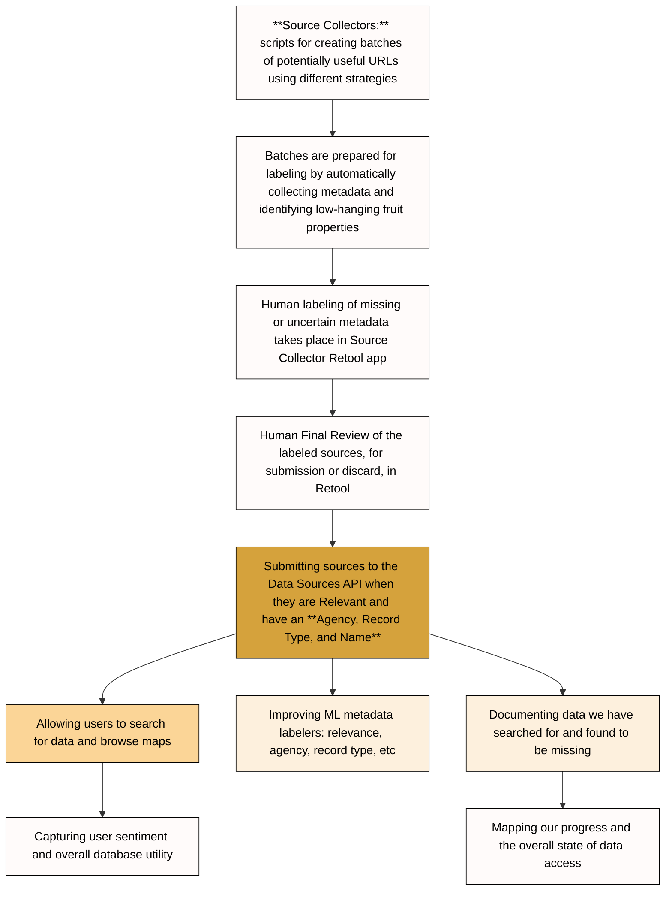
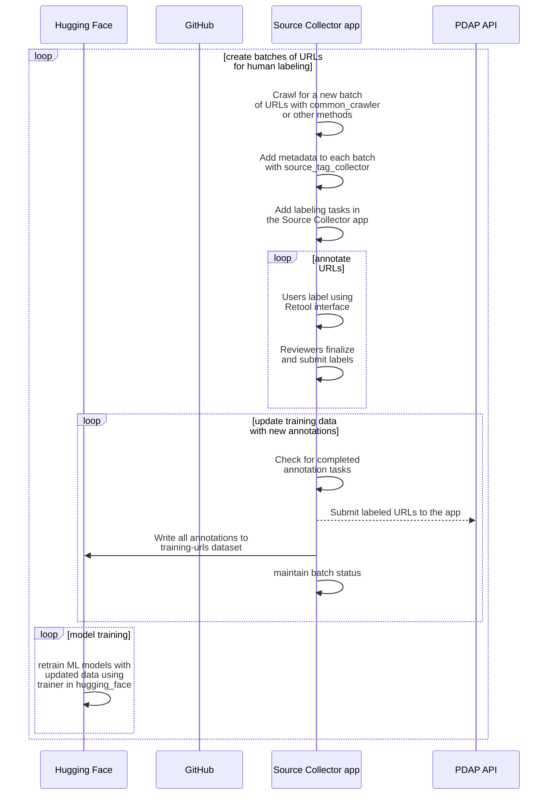

# Architecture

The Source Manager (SM) is a FastAPI application that identifies and catalogues police data sources. It is one half of a two-app system — the other being the [Data Sources App](https://data-sources.pdap.io/api) (DS).

## High-Level Overview

```
Collectors ──> Database ──> Tasks (automated enrichment) ──> Annotation (human review) ──> Sync to DS App
```

1. **Collectors** gather batches of URLs from external sources (Google, CKAN portals, MuckRock, Common Crawl).
2. URLs are stored in the **database** along with batch metadata.
3. **URL tasks** automatically enrich each URL — scraping HTML, identifying agencies, classifying record types, taking screenshots, etc.
4. **Annotation** workflows let humans label and validate the automated results.
5. **Scheduled tasks** synchronize validated data to the Data Sources App and perform housekeeping.

## Module Structure

```
src/
├── api/            # FastAPI routers and endpoint logic
├── core/           # Integration layer — ties everything together
├── db/             # SQLAlchemy models, async database client, queries, DTOs
├── collectors/     # URL collection strategies (pluggable)
├── external/       # Clients for external services (HuggingFace, PDAP, Internet Archive)
├── security/       # JWT validation and permission checks
└── util/           # Shared helpers and utilities
```

### `api/`

The FastAPI application with 15 routers covering 65 endpoints. Each endpoint group follows a consistent structure:

```
endpoints/<group>/
├── routes.py           # Router definition
├── get/ post/ put/ delete/
│   ├── __init__.py     # Endpoint handler
│   ├── query.py        # Database query logic
│   └── dto.py          # Request/response models
└── _shared/            # Logic shared across methods
```

See [api.md](api.md) for the full endpoint reference.

### `core/`

The integration layer. Key components:

- **`AsyncCore`** — central facade that coordinates the collector manager, task manager, and database client. Injected into API endpoints via `app.state`.
- **`AsyncCoreLogger`** — logs operations to the database.
- **`EnvVarManager`** — centralized access to environment variables.
- **Task system** — see [Task System](#task-system) below.

### `db/`

The database layer, built on SQLAlchemy with async support:

- **`client/async_.py`** — `AsyncDatabaseClient`, the primary interface for all database operations.
- **`client/sync.py`** — `DatabaseClient`, used for synchronous initialization (e.g. `init_db`).
- **`models/`** — SQLAlchemy ORM models organized by entity (agency, batch, url, location, etc.), including materialized views and database views.
- **`queries/`** — Complex query builder classes.
- **`dtos/`** — Data transfer objects for passing data between layers.

### `collectors/`

A pluggable system for gathering URLs from different sources. Each collector extends `AsyncCollectorBase`, is registered in `COLLECTOR_MAPPING`, and runs asynchronously. See [collectors.md](collectors.md) for details.

### `external/`

Clients for services outside this repository:

| Client | Purpose |
|--------|---------|
| `huggingface/inference/` | HuggingFace Inference API for ML classification |
| `huggingface/hub/` | HuggingFace Hub for uploading training datasets |
| `pdap/` | PDAP Data Sources API (using `pdap-access-manager`) |
| `internet_archives/` | Internet Archive S3 API for URL preservation |
| `url_request/` | Generic HTTP request interface for scraping |

### `security/`

JWT-based authentication using tokens from the Data Sources App. The `SecurityManager` validates tokens against `DS_APP_SECRET_KEY` and extracts user permissions. Two permission levels are relevant:

- `access_source_collector` — general access to the Source Manager
- `source_collector_final_review` — permission for final review of annotations

## Task System

Tasks are the primary mechanism for automated data enrichment.

### Nomenclature

| Term | Definition |
|------|------------|
| **Collector** | A submodule for collecting URLs from a particular source |
| **Batch** | A group of URLs produced by a single collector run |
| **Cycle** | The full lifecycle of a URL — from initial retrieval to disposal or submission to DS |
| **Task** | A semi-independent operation performed on a set of URLs |
| **Task Set** | A group of URLs operated on together as part of a single task |
| **Task Operator** | A class that performs a single task on a set of URLs |
| **Subtask** | A subcomponent of a Task Operator, often distinguished by collector strategy |

### URL Tasks

URL tasks run against individual URLs to enrich them with metadata. They are triggered by the `RUN_URL_TASKS` scheduled task and managed by the `TaskManager`. Each task is implemented as a **Task Operator**:

| Operator | Purpose |
|----------|---------|
| `html` | Scrapes HTML content from the URL |
| `probe` | Probes the URL for web metadata (status codes, redirects) |
| `root_url` | Extracts and links the root URL |
| `agency_identification` | Matches URLs to agencies using multiple subtask strategies |
| `location_id` | Identifies the geographic location associated with a URL |
| `record_type` | Classifies the record type using ML models |
| `auto_relevant` | Classifies whether the URL is relevant to police data |
| `auto_name` | Generates a human-readable name for the URL |
| `misc_metadata` | Extracts miscellaneous metadata |
| `screenshot` | Captures a screenshot of the URL |
| `validate` | Automatically validates URLs meeting certain criteria |
| `suspend` | Suspends URLs that meet suspension criteria |

### Scheduled Tasks

Scheduled tasks run on a recurring basis (typically hourly) and handle system-wide operations:

| Task | Purpose |
|------|---------|
| Run URL Tasks | Triggers URL task processing |
| Sync to DS (9 tasks) | Synchronizes agencies, data sources, and meta URLs to the Data Sources App (add/update/delete for each) |
| Push to HuggingFace | Uploads annotation data to HuggingFace for model training |
| Internet Archive Probe/Save | Probes and saves URLs to the Internet Archive |
| Populate Backlog Snapshot | Generates a snapshot of the annotation backlog |
| Refresh Materialized Views | Refreshes database materialized views |
| Update URL Status | Updates the processing status of URLs |
| Delete Old Logs | Cleans up old log entries |
| Delete Stale Screenshots | Removes screenshots for already-validated URLs |
| Task Cleanup | Cleans up completed or stale task records |
| Integrity Monitor | Runs integrity checks on the data |

All tasks can be individually enabled or disabled via environment variable flags. See [ENV.md](../ENV.md) for the full list.

## Data Sources App Synchronization

The SM synchronizes three entity types to the DS App:

- **Agencies**
- **Data Sources**
- **Meta URLs**

Each entity has three sync operations (add, update, delete), for nine tasks total. Each task:

1. Queries the SM database for entities that need syncing.
2. Sends a request to the corresponding DS API endpoint (`/v3/sync/{entity}/{action}`).
3. Updates local tracking records (DS App Link tables) to reflect the sync.

Synchronization runs hourly. For full details on preconditions and behavior, see the [Syncing to Data Sources App](../README.md#syncing-to-data-sources-app) section of the root README.

## Identification Pipeline



## Training Pipeline



## Application Startup

On startup (`lifespan` in `src/api/main.py`), the app initializes in this order:

1. `EnvVarManager` and environment variables are loaded.
2. Database clients (`DatabaseClient`, `AsyncDatabaseClient`) are created and the database schema is initialized.
3. An `aiohttp.ClientSession` is created for all outbound HTTP requests.
4. External service clients are created (PDAP, HuggingFace, Internet Archive, MuckRock).
5. The `TaskManager` is built with all URL task operators.
6. The `AsyncCollectorManager` is built and linked to the task manager (so collection triggers processing).
7. `AsyncCore` is assembled from the above components.
8. The `AsyncScheduledTaskManager` is built and its jobs are registered.
9. All three shared objects (`async_core`, `async_scheduled_task_manager`, `logger`) are placed into `app.state` for dependency injection into endpoints.
